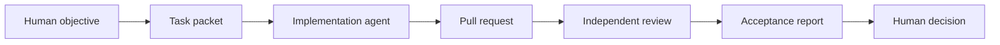

# agentic-project-governance

A lightweight governance template for AI-assisted software projects.

Use this repository when your team uses coding agents, review agents, planning assistants, or multiple AI tools in the same project. It gives you task packets, PR review packets, acceptance reports, safety boundaries, and GitHub templates -- so AI-assisted work is governed, not improvised.

## Why this exists

AI-assisted software projects often fail for boring reasons:

- Tasks are described in chat but not packaged for execution
- AI agents change files outside the intended scope
- The source of truth is unclear
- Implementation agents review their own work
- PRs lack evidence and risk notes
- Acceptance is based on confidence instead of verification
- Private project context leaks into public documentation

This template treats AI-assisted work as a governed delivery process, not a casual conversation.

## What this is

- A generic role model for human and AI collaborators
- A standard workflow from task packet to acceptance report
- Templates for AI-agent tasks, PR review packets, and acceptance reports
- Safety boundaries for private data, credentials, production systems, and external publishing
- GitHub issue and pull request templates
- Minimal fictional examples

## What this is not

- Not a prompt collection
- Not a multi-agent runtime
- Not an AI coding tool
- Not a replacement for GitHub, GitLab, Linear, Jira, or human review
- Not a guarantee that AI-generated code is correct
- Not a production automation framework
- Not a place to store private project details, secrets, credentials, or business-sensitive information

## How this differs

This project does not try to make agents smarter. It makes agent work reviewable.

Prompt collections optimize agent output. Agent runtimes execute tasks. Code quality tools check syntax. This project checks whether the right work was done, with the right evidence, and the right approvals -- the governance layer between "ask an AI" and "ship to production."

## Core principles

```text
Task packet before execution.
GitHub as source of truth.
One PR, one problem.
Implementer does not review itself.
Review must be independent.
Acceptance needs evidence.
High-risk actions require human authorization.
Private facts stay private.
```

## Quick start

1. Copy `templates/task-packet.md` and define the task.
2. Confirm allowed scope, forbidden scope, verification commands, and rollback path.
3. Let an implementation agent work only within the approved scope.
4. Use `templates/pr-review-packet.md` for independent review.
5. Use `templates/acceptance-report.md` before closing the task.
6. Keep private or sensitive details out of public files.

## Minimal workflow



## Workflow diagrams

For detailed channel selection, escalation triggers, and human approval gates, see [docs/workflow.md](docs/workflow.md).

## Template validation

For checklists to verify task packets, PR review packets, and acceptance reports, see [docs/template-validation-guide.md](docs/template-validation-guide.md).

## Repository layout

```text
docs/        Governance concepts and workflow documentation
templates/   Reusable task, review, acceptance, handoff, and risk templates
examples/    Fictional examples only
.github/     Issue and pull request templates
releases/    Release notes
```

## Templates

| Template | Purpose |
|---|---|
| `templates/task-packet.md` | Define an executable AI-agent task with scope, evidence, and rollback |
| `templates/pr-review-packet.md` | Independent review checklist for pull requests |
| `templates/acceptance-report.md` | Evidence-based task closure report |
| `templates/handoff.md` | Context handoff between agents or sessions |
| `templates/risk-register.md` | Track known risks and mitigations |
| `templates/project-current.md` | Current project status snapshot |
| `templates/task-list.md` | Task tracking table |
| `templates/sprint-plan.md` | Sprint planning template |
| `templates/postmortem.md` | Post-incident review |
| `templates/design-review.md` | Design review for UX, copy, safety, and interaction changes |

## Key docs

- `docs/workflow.md` -- channel selection, escalation triggers, and human approval gates
- `docs/template-validation-guide.md` -- checklists for task packets, PR review packets, and acceptance reports
- `docs/safety-boundaries.md` -- safety rules for private data, credentials, production systems, and publishing

## Examples

- `examples/minimal-agentic-project/` -- minimal documentation workflow (task packet -> PR review -> acceptance report)
- `examples/cli-tool-bugfix/` -- fast-to-standard channel escalation
- `examples/dashboard-ui-safety-review/` -- human approval gate for user-facing safety changes
- `examples/documentation-sprint/` -- multi-task documentation sprint and release readiness

## Safety note

Do not put secrets, credentials, private repository links, production configuration, internal paths, customer data, financial data, or company-sensitive information in public examples or templates.

Use fictional examples unless you have explicit permission to publish real project details.

## Roadmap

- v0.1.0: initial draft template release
- v0.2.0: released (examples, workflow diagrams, template validation guide, design review template)
- v0.2.1: main branch documentation polish (not tagged)

### v0.3.0 candidates

Priority items for the next release:

- **P0**: GitHub Action for template validation (advisory checks on pull requests)
- **P0**: Task packet schema / validation configuration
- **P1**: Dependency audit template
- **P2**: Multi-language README translations

Community-contributed examples welcome at any time.

## Contributing

See `CONTRIBUTING.md`. We accept public, sanitized governance templates and fictional examples.

## Status

Latest release: v0.2.0 - usability and review workflow update. Main branch includes post-release documentation polish.

Not a runtime, not a production system, not an enterprise compliance framework, and not a production safety certification.

## License

MIT. See `LICENSE`.
