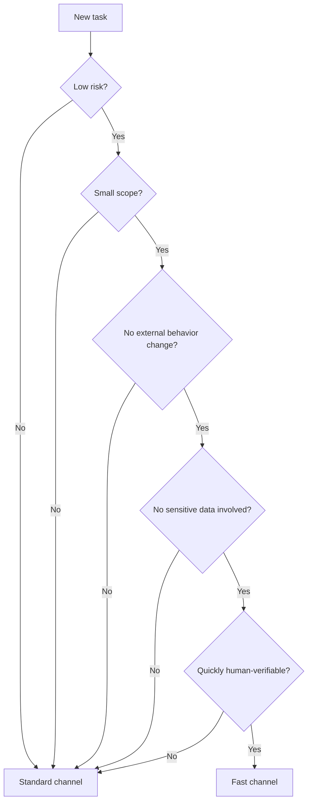
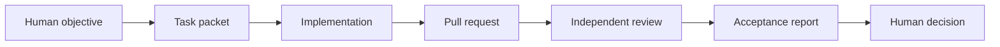
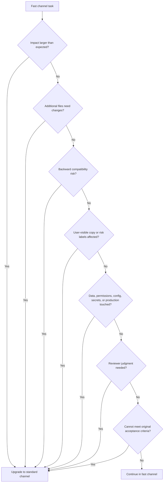
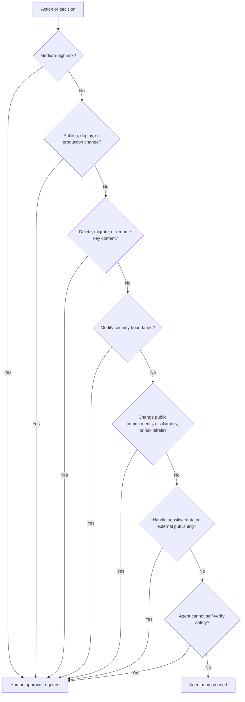

# Workflow

This document defines how tasks flow through the governance process, including channel selection, escalation triggers, and human approval gates.

## Channel selection

Use this decision tree to determine which channel a task should enter.

### Fast channel criteria

All of the following must be true:

- Low risk, clearly reversible change
- Small file scope (one or two files)
- No external behavior change
- No sensitive data, credentials, or production systems involved
- No configuration, permission, or dependency changes
- Quickly human-verifiable

Examples: typo fixes, minor documentation edits, formatting corrections.

### Standard channel criteria

Any of the following triggers the standard channel:

- Involves code logic changes
- Affects user-visible behavior
- Touches security boundaries
- Involves configuration, permissions, releases, data, or dependencies
- Requires independent review
- Requires acceptance evidence

## Standard channel workflow

1. Define task packet with scope, forbidden scope, verification commands, and rollback path.
2. Confirm scope and forbidden scope with the human.
3. Implement on a branch or isolated workspace.
4. Produce evidence (test results, screenshots, verification output).
5. Prepare PR review packet.
6. Run independent review (reviewer must not be the implementer).
7. Prepare acceptance report with evidence.
8. Human decides: merge, hold, or reject.

## Escalation triggers

A task that starts in the fast channel must upgrade to the standard channel if any of the following are discovered during execution.

Summary of escalation triggers:

- Impact larger than expected
- Additional files need modification
- Backward compatibility risk
- User-visible copy or risk labels affected
- Data, permissions, configuration, secrets, or production systems touched
- Reviewer judgment required
- Cannot meet original acceptance criteria

When escalation triggers, stop fast channel execution, create a task packet, and restart in the standard channel.

## Human approval gates

Some decisions cannot be made by an agent alone. These require explicit human approval before proceeding.

Summary of human approval gates:

- Medium or high risk action
- Publishing, deployment, or production changes
- Deletion, migration, or renaming of key content
- Modification of security boundaries
- Changes to public commitments, disclaimers, or risk labels
- Handling sensitive data or external publishing
- Agent cannot self-verify safety

Human approval is a merge blocker. A PR that passes review but lacks required human approval cannot be merged.

## Stop conditions

Stop and ask a human when:

- Scope is unclear or conflicting
- Required files or facts are missing
- The agent needs permission escalation
- The task involves secrets, production systems, or destructive actions
- Verification cannot be performed
- The task requires external publishing
- An escalation trigger fires but the agent cannot determine the new channel

## Channel summary

| Aspect | Fast channel | Standard channel |
|---|---|---|
| Risk level | Low | Medium to high |
| Scope | One or two files, no behavior change | Code logic, multiple files, behavior change |
| Review | Quick human check | Independent review with PR review packet |
| Acceptance | Visual confirmation | Acceptance report with evidence |
| Escalation | Automatic if triggers fire | N/A |
| Human approval | Not required unless risk appears | Required for merge on medium-high risk |
